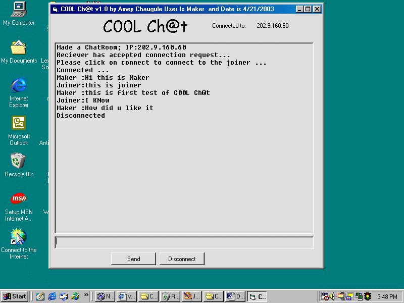



## \[\!\!\!\!\! C00l Ch@t  \!\!\!\!\!\]

### Description

A Basic Chat Program written in extremely clean and reader friendly code. Good for the newbies to Socket programming. 2 ppl can use this program in a chat room at a particualr time . This program can also be run from a single computer by running 2 copies simultaneously.
 
### More Info
 
This program demonstrates basic use of Winsick controls in VB 6.0.

If One of the two persons using this program is not ready (meaning has not configured this program) & the second person tries to connect then this will result into a Run time error.

             |
---                |---
**Submitted On**   |2003-04-21 01:54:38
**By**             |[Amey Chaugule](https://github.com/Planet-Source-Code/PSCIndex/blob/master/ByAuthor/amey-chaugule.md)
**Level**          |Beginner
**User Rating**    |4.4 (22 globes from 5 users)
**Compatibility**  |VB 6\.0
**Category**       |[Complete Applications](https://github.com/Planet-Source-Code/PSCIndex/blob/master/ByCategory/complete-applications__1-27.md)
**World**          |[Visual Basic](https://github.com/Planet-Source-Code/PSCIndex/blob/master/ByWorld/visual-basic.md)
**Archive File**   |[C00l\_Ch@t1577324212003\.zip](https://github.com/Planet-Source-Code/amey-chaugule-c00l-ch-t__1-44920/archive/master.zip)

